<div align="center">

# LedgerLens

### Enterprise Multimodal Financial RAG with Role-Based Access Control

LedgerLens is a secure Retrieval-Augmented Generation system for financial documents.  
It ingests reports, fund statements, tables, and market charts, then answers questions using role-aware retrieval, guarded synthesis, and evaluation-backed reliability.

<br/>


</div>

---

## Overview

Financial institutions handle large volumes of sensitive and mixed-format data. This includes unstructured reports, tabular fund statements, and visual market charts.

Traditional retrieval systems often fail on this type of data because they break table structure, lose numeric context, and do not enforce strict access control before retrieval.

LedgerLens solves this by combining:

- Multimodal document ingestion
- Layout-aware parsing
- Metadata-driven RBAC
- Hybrid dense and sparse retrieval
- Query decomposition
- Cross-encoder reranking
- Context compression
- Input and output guardrails
- Offline RAG evaluation

---

## Why LedgerLens?

Most RAG systems are not safe enough for financial data.

A normal RAG pipeline may retrieve unauthorized chunks and only try to control the final answer through prompting. That is not enough for enterprise use.

LedgerLens enforces access control before the LLM sees any context.

```text
metadata.allowed_roles ∩ user.permission_groups != ∅
```

If the user does not have permission for a document chunk, that chunk is not retrieved.

---

## Core Features

### Multimodal Financial Ingestion

LedgerLens is designed to process:

- PDF reports
- CSV files
- XLSX statements
- Markdown files
- Market chart images
- Financial tables

The ingestion pipeline preserves:

- Row and column boundaries
- Numeric values
- Page-level context
- Document metadata
- Chart and image meaning

---

### Layout-Aware Parsing

Financial tables lose meaning when rows, columns, and labels are separated incorrectly.

LedgerLens uses layout-aware parsing so values stay connected to their context.

Example:

```text
Bad parsing:
Revenue
Q3
12.4M

Good parsing:
Revenue | Q3 | 12.4M
```

This is important for financial QA because small formatting errors can create wrong answers.

---

### Role-Based Access Control

Each chunk is enriched with RBAC metadata.

```json
{
  "allowed_roles": ["analyst", "fund-a"],
  "document_id": "document_uuid",
  "source_filename": "q3_fund_report.pdf",
  "uploaded_by": "user_123",
  "doc_type": "pdf",
  "fund_family": "fund-a",
  "report_period": "2024-Q3"
}
```

At query time, retrieval is filtered using the user's permission groups.

This prevents restricted documents from reaching the model.

---

### Hybrid Retrieval

LedgerLens uses both semantic and keyword-based search.

Dense search helps with meaning:

```text
"What changed in the portfolio risk exposure?"
```

Sparse search helps with exact financial terms:

```text
"ISIN US0378331005"
"Q3 NAV"
"Fund A"
```

Final score:

```text
score = alpha * dense_score + (1 - alpha) * sparse_score
```

---

### Query Decomposition

Complex questions are split into smaller sub-queries.

Input question:

```text
"What changed in Fund A revenue and risk exposure between Q2 and Q3?"
```

Sub-queries:

```text
1. Fund A revenue Q2
2. Fund A revenue Q3
3. Fund A risk exposure Q2
4. Fund A risk exposure Q3
```

This improves retrieval quality for multi-part financial questions.

---

### Reranking and Compression

After retrieval, LedgerLens applies:

- Cross-encoder reranking
- Context compression
- Source deduplication
- Boilerplate removal

This keeps the final LLM context smaller, cleaner, and more relevant.

---

### Guarded Generation

LedgerLens applies guardrails before and after generation.

Input guardrails block:

- Prompt injection
- Unsafe instructions
- Attempts to bypass access control

Output guardrails reduce:

- Unsupported claims
- Restricted data leakage
- Hallucinated financial metrics
- Irrelevant answers

---

### Evaluation Harness

LedgerLens includes an offline evaluation layer for testing RAG quality.

| Metric | Formula / Target | Purpose |
|---|---|---|
| Context Relevance | Retrieved Relevant Chunks / Total Retrieved | Measures retrieval precision |
| Faithfulness | Claims Grounded in Context / Total Claims | Checks whether answers are grounded in retrieved evidence |
| Answer Relevance | Match to User Intent | Checks whether the answer addresses the question |

---

## Architecture

```mermaid
flowchart LR
    A[Raw Financial Documents] --> B[Layout-Aware Parser]
    B --> C[Chunking and Metadata Enrichment]
    C --> D[Dense Embeddings and Sparse Tokens]
    D --> E[Qdrant Vector Store]

    U[User Query + JWT] --> F[FastAPI Gateway]
    F --> G[Input Guardrails]
    G --> H[Semantic Cache]
    H --> I[Query Decomposition Router]
    I --> J[Hybrid Search]

    E --> J

    J --> K[RBAC Metadata Filter]
    K --> L[Cross-Encoder Reranker]
    L --> M[Context Compressor]
    M --> N[Multimodal LLM]
    N --> O[Output Guardrails]
    O --> P[Final Answer with Sources]

    P --> Q[Evaluation Harness]
```



---

## System Flow

### Ingestion Flow

```text
Raw File
  -> Layout-Aware Parser
  -> Text, Table, and Image Extraction
  -> Metadata Enrichment
  -> Dense Embedding
  -> Sparse Tokenization
  -> Qdrant Indexing
```

### Runtime Flow

```text
User Query
  -> JWT Validation
  -> Input Guardrail
  -> Semantic Cache Lookup
  -> Query Decomposition
  -> Hybrid Search with RBAC Filter
  -> Reranking
  -> Context Compression
  -> LLM Synthesis
  -> Output Guardrail
  -> Final Answer
```

### Evaluation Flow

```text
Ground Truth Questions
  -> Run RAG Pipeline
  -> Collect Retrieved Context
  -> Collect Generated Answer
  -> Score Faithfulness, Context Relevance, and Answer Relevance
```

---

## Tech Stack

| Layer | Tools |
|---|---|
| API | FastAPI, Uvicorn |
| Auth | JWT, PyJWT, RBAC Middleware |
| Vector Database | Qdrant |
| Embeddings | Sentence Transformers, BGE |
| Sparse Retrieval | BM25-style sparse vectors |
| Parsing | LlamaParse, pdfplumber, markdownify |
| LLM Client | OpenAI-compatible clients |
| Reranking | BGE Reranker |
| Compression | LLMLingua |
| Cache | Redis, Semantic Cache |
| Evaluation | Ragas, Datasets |
| Observability | Structlog, OpenTelemetry, Prometheus |
| Deployment | Docker |

---

## Repository Structure

```text
LedgerLens/
├── app/
│   ├── core/
│   │   ├── config.py
│   │   ├── exceptions.py
│   │   └── security.py
│   ├── db/
│   │   ├── database.py
│   │   └── models.py
│   ├── models/
│   │   └── schemas.py
│   ├── routers/
│   │   ├── auth.py
│   │   ├── evaluation.py
│   │   ├── health.py
│   │   ├── ingestion.py
│   │   └── query.py
│   ├── services/
│   │   ├── cache.py
│   │   ├── compressor.py
│   │   ├── embeddings.py
│   │   ├── etl.py
│   │   ├── evaluation.py
│   │   ├── guardrails.py
│   │   ├── llm.py
│   │   ├── parser.py
│   │   ├── reranker.py
│   │   └── vector_store.py
│   ├── utils/
│   │   └── logging_config.py
│   └── main.py
├── tests/
├── Dockerfile
├── pyproject.toml
├── LICENSE
└── README.md
```

---

## API Endpoints

| Method | Endpoint | Description |
|---|---|---|
| GET | `/health` | Health check |
| POST | `/auth/token` | Generate a test JWT with user roles |
| POST | `/ingest/upload` | Upload a financial document for async parsing and indexing |
| GET | `/ingest/{document_id}/status` | Check ingestion status |
| POST | `/query/` | Ask a question using the RAG pipeline |
| POST | `/evaluate/run` | Run the RAG evaluation harness |

---

## Quick Start

### 1. Clone the Repository

```bash
git clone https://github.com/lkshbhushan001/LedgerLens.git
cd LedgerLens
```

---

### 2. Create a Virtual Environment

```bash
python -m venv .venv
source .venv/bin/activate
```

For Windows:

```bash
.venv\Scripts\activate
```

---

### 3. Install Dependencies

```bash
pip install --upgrade pip
pip install -e ".[dev]"
```

---

### 4. Create a `.env` File

Create a `.env` file in the project root.

```env
APP_NAME=Financial RAG API
DEBUG=true
ENVIRONMENT=development

SECRET_KEY=replace_with_a_32_character_minimum_secret_key
ACCESS_TOKEN_EXPIRE_MINUTES=30
ALGORITHM=HS256

QDRANT_URL=http://localhost:6333
QDRANT_API_KEY=
QDRANT_COLLECTION=financial_documents

EMBEDDING_MODEL=BAAI/bge-large-en-v1.5
EMBEDDING_DEVICE=cpu

GROQ_API_KEY=replace_with_your_groq_api_key
ROUTER_MODEL=llama-3.3-70b-versatile
SYNTHESIS_MODEL=llama-3.2-90b-vision-preview
VISION_MODEL=llama-3.2-90b-vision-preview
LLM_TEMPERATURE=0.1
LLM_MAX_TOKENS=2048

LLAMA_CLOUD_API_KEY=

REDIS_URL=redis://localhost:6379/0

RERANKER_MODEL=BAAI/bge-reranker-large

OTEL_SERVICE_NAME=financial-rag
OTEL_EXPORTER_OTLP_ENDPOINT=
```

---

### 5. Start Qdrant

```bash
docker run -p 6333:6333 qdrant/qdrant
```

---

### 6. Start Redis

```bash
docker run -p 6379:6379 redis:latest
```

---

### 7. Run the API

```bash
uvicorn app.main:app --reload --host 0.0.0.0 --port 8000
```

Open the API docs:

```text
http://localhost:8000/docs
```

---

## Docker Usage

Build the image:

```bash
docker build -t ledgerlens .
```

Run the container:

```bash
docker run -p 8000:8000 --env-file .env ledgerlens
```

---

## Example Usage

### Generate a Test JWT

```bash
curl -X POST "http://localhost:8000/auth/token" \
  -H "Content-Type: application/json" \
  -d '{
    "user_id": "user_123",
    "email": "analyst@example.com",
    "permission_groups": ["analyst", "fund-a"],
    "is_admin": false
  }'
```

Example response:

```json
{
  "access_token": "your_jwt_token",
  "token_type": "bearer"
}
```

---

### Upload a Financial Document

```bash
curl -X POST "http://localhost:8000/ingest/upload" \
  -H "Authorization: Bearer <JWT_TOKEN>" \
  -F "file=@sample_report.pdf" \
  -F "doc_type=pdf" \
  -F "allowed_roles=analyst,fund-a" \
  -F "fund_family=fund-a" \
  -F "report_period=2024-Q3"
```

Example response:

```json
{
  "document_id": "document_uuid",
  "source_filename": "sample_report.pdf",
  "doc_type": "pdf",
  "rbac": {
    "allowed_roles": ["analyst", "fund-a"],
    "document_id": "document_uuid",
    "source_filename": "sample_report.pdf",
    "uploaded_by": "user_123",
    "doc_type": "pdf",
    "fund_family": "fund-a",
    "report_period": "2024-Q3"
  },
  "chunk_count": 0,
  "processing_status": "processing"
}
```

---

### Check Ingestion Status

```bash
curl -X GET "http://localhost:8000/ingest/<DOCUMENT_ID>/status"
```

Example response:

```json
{
  "document_id": "document_uuid",
  "status": "completed"
}
```

---

### Ask a Question

```bash
curl -X POST "http://localhost:8000/query/" \
  -H "Authorization: Bearer <JWT_TOKEN>" \
  -H "Content-Type: application/json" \
  -d '{
    "question": "What were the key revenue changes in the Q3 fund report?",
    "top_k": 5
  }'
```

Example response:

```json
{
  "answer": "The Q3 report shows...",
  "sources": [
    {
      "chunk_id": "chunk_uuid",
      "text": "Relevant retrieved text...",
      "score": 0.91,
      "chunk_type": "table",
      "page_number": 4
    }
  ],
  "latency_ms": 842.32,
  "cache_hit": false,
  "guardrail_passed": true
}
```

---

### Run Evaluation

Admin access is required.

```bash
curl -X POST "http://localhost:8000/evaluate/run" \
  -H "Authorization: Bearer <ADMIN_JWT_TOKEN>" \
  -H "Content-Type: application/json" \
  -d '{
    "test_cases": [
      {
        "question": "What is the reported AUM for Fund A in Q3?",
        "expected_answer": "The reported AUM for Fund A in Q3 is..."
      }
    ]
  }'
```

Example response:

```json
{
  "context_relevance": 0.86,
  "faithfulness": 0.91,
  "answer_relevance": 0.88,
  "overall_score": 0.88,
  "evaluated_at": "2026-01-01T00:00:00Z"
}
```

---

## Security Design

LedgerLens is designed around one main rule:

```text
Never retrieve what the user is not allowed to see.
```

Security is enforced through:

- JWT-based identity
- Permission groups attached to each user
- `allowed_roles` attached to every chunk
- Qdrant metadata filtering during retrieval
- Admin-only evaluation routes
- Input and output guardrails

This keeps access control close to the retrieval layer instead of relying only on prompts.

---

## Example Use Cases

### Fund Analysis

```text
Question:
"What changed in Fund A exposure between Q2 and Q3?"

LedgerLens:
Retrieves only Fund A documents the user can access, compares the relevant chunks, and generates a grounded answer with sources.
```

---

### Risk Review

```text
Question:
"Summarize the main risk factors mentioned in the latest portfolio report."

LedgerLens:
Uses hybrid search to retrieve risk-related sections and compresses the context before synthesis.
```

---

### Table-Based QA

```text
Question:
"What was the reported NAV for the fund in 2024-Q3?"

LedgerLens:
Preserves table structure during ingestion so numeric values stay connected to row and column labels.
```

---

### Chart Understanding

```text
Question:
"What trend is visible in the market performance chart?"

LedgerLens:
Uses image descriptions generated during ingestion so chart-level information can be searched and used in answers.
```

---

## Evaluation Philosophy

LedgerLens treats RAG quality as something that should be tested, not guessed.

The evaluation harness helps answer:

- Did retrieval find the right chunks?
- Did the model stay faithful to the retrieved context?
- Did the answer match the user's intent?
- Did the change improve or hurt the pipeline?

This makes the system easier to debug and safer to improve.

---

## Project Highlights

LedgerLens demonstrates practical engineering across:

- Enterprise RAG architecture
- Secure retrieval systems
- Role-based access control
- Financial document intelligence
- Multimodal ingestion
- FastAPI backend design
- Vector database search
- LLM guardrails
- RAG evaluation

---

## Roadmap

- [ ] Add production SSO integration
- [ ] Add document deletion and re-indexing workflow
- [ ] Add dashboard for ingestion and query logs
- [ ] Add CI-based evaluation regression checks
- [ ] Add per-fund audit trails
- [ ] Add streaming responses
- [ ] Add richer chart interpretation
- [ ] Add cloud deployment templates

---

## License

This project is licensed under the MIT License.

---

<div align="center">

Built for secure, auditable, enterprise-grade financial document intelligence.

</div>
